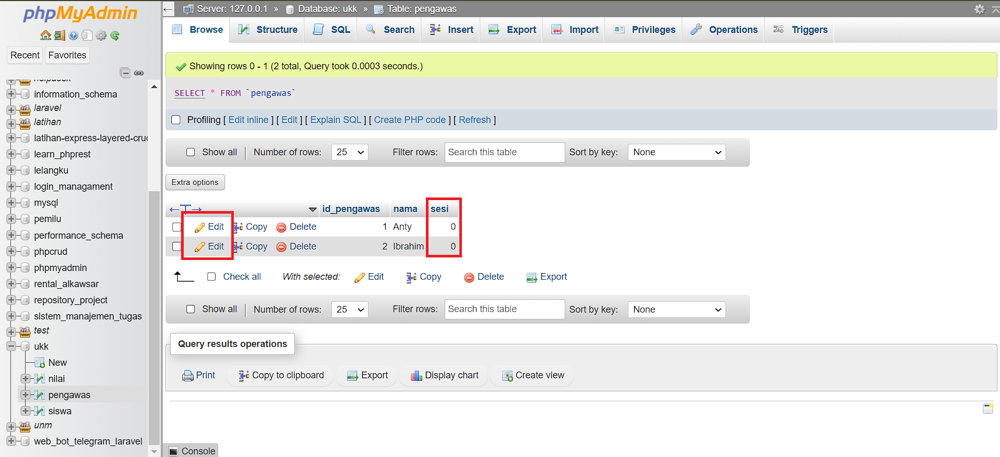

# Pembuatan Database

1. Pertama, Silahkan buka aplikasi XAMPP terlebih dahulu, kemudian tekan tombol **“Start”** pada **Apache** dan **MySQL**. Jika tombol “Start” telah berubah menjadi “Stop” maka sudah dapat dipastikan aplikasi Apache dan MySQL dapat digunakan.
   
2. Setelah server apache dan mysql sudah diaktifkan, buka browser yang kalian miliki lalu ketikkan pada kotak URL "**localhost/phpmyadmin**"
   
3. Akan muncul tampilan seperti ini. Selanjutnya pada sidebar menu klik **New** untuk membuat database baru.
   
4. Setelah muncul tampilan seperti ini, masukkan nama database “**ukk**” pada fitur Create database lalu tekan tombol **Create**.
   
5. Pada sidebar menu, akan muncul database yang telah dibuat yaitu dengan nama **ukk**.
   

# Membuat Tabel

## Buat `siswa`

1. Setelah membuat database ukk, langkah selanjutnya adalah membuat tabel yang diperlukan. Di sini, kita akan membuat tabel `siswa` dengan dua kolom.
2. Selanjutnya, klik tombol `Create`.
   
3. Setelah itu, masukkan rincian kolom seperti nama kolom, tipe data, panjang data. pada kolom tabel `siswa` terdapat 2 Kolom yaitu `nis` dan `nama`, Pastikan untuk menandai kolom `nis` sebagai atribut `PRIMARY KEY`.
   
4. Pastikan untuk menekan tombol 'Save' atau 'OK' setelah selesai mengkonfigurasi tabel.
5. Sekarang, tabel `siswa` telah dibuat dengan jumlah kolom 2, yaitu `nis` dan `nama`.
   

## Buat `pengawas`

sama seperti sebelumnya, sekarang kita membuat tabel `pengawas`.

1. Pertama, kita akan membuat tabel `pengawas` dengan dua kolom.
   
2. Kemudian, tekan tombol `Create`.
3. Selanjutnya, masukkan rincian kolom seperti nama kolom, tipe data, panjang data. pada kolom tabel `pengawas` terdapat 2 Kolom yaitu `id_pengawas` dan `nama`, Pastikan untuk menandai kolom `id_pengawas` sebagai atribut `PRIMARY KEY`.
   
4. Pastikan untuk menekan tombol 'Save' atau 'OK' setelah selesai mengkonfigurasi tabel.
5. Sekarang, tabel `pengawas` telah dibuat dengan jumlah kolom 2, yaitu `id_pengawas` dan `nama`.
   

## Buat `nilai`

sama seperti sebelumnya, sekarang kita membuat tabel `nilai`.

1. Pertama, kita akan membuat tabel `nilai` dengan tiga kolom
   
2. Kemudian, tekan tombol `Create`.
3. Selanjutnya, masukkan rincian kolom seperti nama kolom, tipe data, panjang data. pada kolom tabel `nilai` terdapat 3 Kolom yaitu `nis_siswa`, `id_pengawas` dan `nilai`.
   
4. Pastikan untuk menekan tombol 'Save' atau 'OK' setelah selesai mengkonfigurasi tabel.
5. Sekarang, tabel `pengawas` telah dibuat dengan jumlah kolom 3, yaitu `nis`, `id_pengawas` dan `nilai`.
   

# Relasi Tabel Nilai: Siswa dan Pengawas

nah seperti yang kita ketahui, kita telah membuat tabel nilai yang mempunyai 3 kolom. Sekarang, kita ingin menghubungkan atau meng-relasikan kolom kolom dari tabel nilai dengan kedua tabel sebelumnya yaitu siswa dan pengawas.

1. Pertama, kita masuk ke halaman tabel `nilai`.
   
2. Setelah itu, klik pada menu bar yaitu `Structure`.
3. Selanjutnya, pada halaman `Structure` di tabel `nilai` terdapat tombol `Relation view`.
   
4. Setelah di klik kita akan diarahkan ke halaman untuk membuat constraint .
5. pada constraint pertama yang akan kita buat adalah constraint antara kolom `id_pengawas` dari tabel `nilai` ke kolom `id_pengawas` dari tabel `pengawas`. Kita akan menamakan constraint ini “fk_nilai_pengawas” dan mengubah `ON DELETE` dan `UPDATE` constraint ini menjadi `CASCADE` *(yang berarti, jika data dari salah satu kolom yang terhubung di constraint ini terubah/terhapus maka datanya di kolom lain yang terhubung dengannya akan terubah/terhapus juga)*.
6. Lakukan juga untuk kolom `nis_siswa`.
   
7. Pastikan untuk menekan tombol 'Save' setelah selesai mengkonfigurasi tabel.
8. Untuk melihat hasil relasinya, pertama klik database `ukk`. Lalu pada menu bar di pojok kanan atas terdapat tombol `Designer`
   
9. Setelah di klik, kita akan melihat hasil relasi yang kita sudah lakukan. Seperti gambar di bawah ini.
   
10. Jadi terdapat 3 tabel yaitu tabel `siswa`, `pengawas` dan `nilai`. Dalam tabel tabel tersebut, ada penanda bahwa kolom tersebut telah terhubung dengan antar satu tabel.

Pada tabel `nilai` kolom `nis_siswa` telah terhubung dengan `PRIMARY KEY` dari tabel `siswa` yaitu kolom `nis`.

Pada tabel nilai kolom `id_pengawas` telah terhubung dengan `PRIMARY KEY` dari tabel `pengawas` yaitu kolom `id_pengawas`.

> [FAQ] Kenapa Primary Key yang dipilih?
>  Karena kolom tersebutlah yang memiliki **keunikan** pada isi datanya sehingga bisa menjadi identitas dari suatu tabel atau **induk** dari suatu tabel agar bisa terhubung datanya dengan baik bersama tabel lain.

# Input Data

## Input Data pada `siswa`

1. Pertama kita masuk ke halaman tabel `siswa`.
   
2. Setelah di halaman tabel `siswa`, terdapat menu bar di atas yaitu `Insert`. Lalu klik menu tersebut.
   
3. Masukkan datanya sesuai kebutuhan, disini terdapat 2 kolom yang perlu di isi yaitu `nis` dan `nama`.
   
4. Pastikan untuk menekan tombol 'Go' setelah selesai memasukkan datanya.
5. Untuk melihat hasil data yang telah kita masukkan, pilih menu bar di atas yaitu `Browse`.
6. Sekarang, data tabel `siswa` telah terisi.
   

## Input Data pada `pengawas`

sama seperti sebelumnya, sekarang kita akan memasukkan data pada tabel `pengawas`.

1.  Pertama kita masuk ke halaman tabel `pengawas`.
2.  Setelah di halaman tabel `siswa`, terdapat menu bar di atas yaitu `Insert`. Lalu klik menu tersebut.
3.  Masukkan datanya sesuai kebutuhan, disini terdapat 2 kolom yang perlu di isi yaitu `id_pengawas` dan `nama`.
    
4.  Pastikan untuk menekan tombol 'Go' setelah selesai memasukkan datanya.
5.  Untuk melihat hasil data yang telah kita masukkan, pilih menu bar di atas yaitu `Browse`.
6.  Sekarang, data tabel `pengawas` telah terisi.
    

## Input Data pada `nilai`

sama seperti sebelumnya, sekarang kita akan memasukkan data pada tabel `pengawas`.

1. Pertama kita masuk ke halaman tabel `nilai`.
   
2. Setelah di halaman tabel `nilai`, terdapat menu bar di atas yaitu `Insert`. Lalu klik menu tersebut.
   
3. Berbeda dengan tabel sebelumnya, di tabel nilai kolom `nis` dan `id_pengawas` kita tidak harus terlalu susah lagi dalam mengisi data data pada kolom yang telah terelasi atau terhubung.
   
4. Pastikan untuk menekan tombol `'Go'` setelah selesai memasukkan datanya.
5. Untuk melihat hasil data yang telah kita masukkan, pilih menu bar di atas yaitu `Browse`.
6. Sekarang, data tabel `nilai` telah terisi.
   

# Menambah Kolom `sesi` pada Tabel `pengawas`

1. Pertama kita masuk ke halaman tabel `pengawas`.
   
2. Kemudian pada menu bar diatas, terdapat menu `Structure`.
   
3. Setelah di klik, maka anda di arahkan ke halaman Structure, terdapat dua kolom gambar dibawah ini.
   
4. Tambahkan kolom satu saja karna kita hanya mau menambah kan satu kolom saja.
5. Pastikan untuk menekan tombol `'Go'` setelah selesai.
6. Selanjutnya, masukkan rincian kolom seperti nama kolom, tipe data, panjang data. Dalam hal ini kita menambahkan kolom `sesi`.
   
7. Pastikan untuk menekan tombol 'Save' atau 'OK' setelah selesai mengkonfigurasi tabel.
8. Sekarang, kolom tabel `pengawas` telah tertambah menjadi 3 yaitu `id_pengawas`, `nama` dan `sesi` .
   
9. Karena kita telah menambah kolom pada tabel pengawas, maka kita perlu mengubah datanya
10. Kembali ke halaman `Browse`. pada halaman `Browse` bisa kita lihat di baris datanya pada kolom `sesi` nilainya masih 0, terdapat tombol `Edit` klik tombol tersebut untuk mengubah baris nilainya.
    
11. Setelah itu, ubah nilainya sesuai kebutuhan disini saya mengubah nilainya menjadi `2`
    
12. Pastikan untuk menekan tombol 'Go' setelah selesai memasukkan datanya.
13. Sekarang, data tabel `pengawas` telah berubah .
    

# Query Relasi yang Nilainya > 75

1. Pertama, untuk melakukan query di phpmyadmin ada banyak cara, disini saya mencontohkan salah satunya.
2. Karena disini kita akan melakukan query relasi di tabel `pengawas`, maka kita perlu ke halaman tabel `pengawas` terlebih dahulu.
3. Kemudian terdapat tombol `Edit` dan `Edit inline` Anda dapat memilih salah satunya.
   
4. Pastikan untuk menekan tombol `'Go'` setelah selesai menuliskan querynya.
5. Untuk query relasi yang nilainya > 75, dapat dilihat sebagai berikut.

```sql
SELECT s.nama, n.nilai
FROM nilai AS n
INNER JOIN siswa AS s ON s.nis = n.nis
WHERE n.nilai > 75;
```

- `SELECT s.nama, n.nilai` : Memilih kolom yang ingin ditampilkan, disini kita menampilkan kolom `nama` pada tabel `siswa` dan kolom `nilai` pada tabel `nilai`
- `FROM nilai AS n` : disini kita mengambil dari tabel `nilai` dan menggunakan `ALIAS` untuk menyingkat nama tabel.
- `INNER JOIN siswa AS s` : digunakan untuk merelasikan beberapa tabel, disini kita relasi dengan tabel `siswa`.
- `ON s.nis = n.nis` : data kolom `nis` dari tabel `siswa` harus memiliki data yang sama dengan data kolom `nis` pada tabel `nilai`.
- `WHERE n.nilai > 75` : Klausa di atas akan menjadi kondisi, dimana kondisi data pada kolom nilai yang lebih dari 75 akan ditampilkan

Untuk melihat hasilnya dapat dilihat sebagai berikut.


# Query Relasi untuk Pengawas `Anty`

sama seperti sebelumnya pada relasi nilai > 75.

1. Pertama, kita perlu ke halaman tabel `pengawas` terlebih dahulu.
2. Kemudian terdapat tombol `Edit` dan `Edit inline` Anda dapat memilih salah satunya.
   
3. Pastikan untuk menekan tombol `'Go'` setelah selesai menuliskan querynya.
4. Untuk query relasi yang `pengawasnya Anty`, dapat dilihat sebagai berikut.

```sql
SELECT s.nama AS 'Nama Siswa', n.nilai, p.nama AS 'Nama Guru'
FROM nilai AS n
INNER JOIN siswa AS s
INNER JOIN pengawas AS p
ON n.nis = s.nis AND n.id_pengawas = p.id_pengawas
WHERE p.id_pengawas = 1;
```

- `SELECT s.nama AS 'Nama Siswa', n.nilai, p.nama AS 'Nama Guru'` : Memilih kolom yang ingin ditampilkan, disini kita menampilkan kolom `nama` pada tabel `siswa`, kolom `nilai` pada tabel `nilai` dan kolom nama pada tabel `pengawas`
- `FROM nilai AS n` : disini kita mengambil dari tabel `nilai` dan menggunakan `ALIAS` untuk menyingkat nama tabel.
- `INNER JOIN siswa AS s` : digunakan untuk merelasikan beberapa tabel, disini kita relasi dengan tabel `siswa`.
- `INNER JOIN pengawas AS p` : digunakan untuk merelasikan beberapa tabel, disini kita relasi dengan tabel `pengawas`.
- `ON n.nis = s.nis AND n.id_pengawas = p.id_pengawas` : data kolom `nis` dari tabel `siswa` harus memiliki data yang sama dengan data kolom `nis` pada tabel `nilai` dan data kolom `id_pengawas` dari tabel nilai harus memiliki data yang sama dengan data kolom `id_pengawas` pada tabel `pengawas`.
- `WHERE p.id_pengawas = 1`: Menunjukkan kondisi di mana hanya baris-baris di mana nilai kolom `id_pengawas` dari tabel `pengawas` sama dengan 1 untuk ditampilkan.

Untuk melihat hasilnya dapat dilihat sebagai berikut.


# Commit dan Rollback

- ==`COMMIT`== : Menyimpan transaksi secara permanen
- ==`ROLLBACK`== : Mengembalikan database ke bentuk awal / COMMIT terakhir

Penting untuk dicatat bahwa transaksi harus dimulai dengan perintah `START TRANSACTION`, kemudian diikuti dengan serangkaian perubahan data, dan diakhiri dengan `COMMIT` jika transaksi berhasil atau `ROLLBACK` jika transaksi perlu dibatalkan. Dengan menggunakan commit dan rollback, Anda dapat memastikan konsistensi data dan meminimalkan risiko kehilangan data atau kondisi anomali lainnya dalam database Anda.

## Cara Menggunakan Perintah COMMIT MySQL

1. Pertama, untuk melakukan query di phpmyadmin ada banyak cara, disini saya mencontohkan salah satunya.
2. Pada contoh commit ini, disini kita akan melakukan query di tabel `siswa`, maka kita perlu ke halaman tabel `siswa` terlebih dahulu.
3. Kemudian terdapat tombol `Edit` dan `Edit inline` Anda dapat memilih salah satunya.
   
4. Untuk melakukan perintah COMMIT, Pertama Mulai transaksi, gunakan perintah `START TRANSACTION` untuk memulai transaksi baru.

```mysql
START TRANSACTION;
```

 5. Selanjutnya, jalankan perintah-perintah SQL seperti `INSERT`, `UPDATE`, atau `DELETE` yang ingin Anda lakukan di dalam transaksi.

```mysql
INSERT INTO siswa (nis, nama) VALUES (22356, 'Chairil Abizali');
DELETE FROM siswa WHERE nis = 22352;
```

 6. Selama proses transaksi, perhatikan kondisi-kondisi yang mungkin memerlukan penyimpanan perubahan ke database. 7. Kemudian, simpan perubahan dengan COMMIT, Jika semua perintah dalam transaksi berhasil dieksekusi dan tidak ada masalah, gunakan perintah `COMMIT` untuk menyimpan perubahan ke database. 8. Pastikan untuk menekan tombol `'Go'` setelah selesai menuliskan querynya.

```mysql
COMMIT;
```


## Cara Menggunakan Perintah ROLLBACK MySQL

1. Pertama, untuk melakukan query di phpmyadmin ada banyak cara, disini saya mencontohkan salah satunya.
2. Pada contoh rollback ini, disini kita akan melakukan query di tabel `siswa`, maka kita perlu ke halaman tabel `siswa` terlebih dahulu.
3. Kemudian terdapat tombol `Edit` dan `Edit inline` Anda dapat memilih salah satunya.
   
4. Sama seperti perintah COMMIT, Untuk melakukan perintah ROLLBACK, Pertama Mulai transaksi, gunakan perintah `START TRANSACTION` untuk memulai transaksi baru.

```mysql
START TRANSACTION;
```

 5. Selanjutnya, jalankan perintah-perintah SQL seperti `INSERT`, `UPDATE`, atau `DELETE` yang ingin Anda lakukan di dalam transaksi.

```mysql
-- Menambahkan data siswa baru
INSERT INTO siswa (nis, nama) VALUES (223510, 'Taufiq Adiguna');
INSERT INTO siswa (nis, nama) VALUES (22359, 'Nabil Shiddiq');
```

 6. Selama proses transaksi, perhatikan kondisi-kondisi yang mungkin memerlukan pembatalan transaksi, seperti kesalahan atau situasi yang tidak diinginkan. 7. Jika terjadi kesalahan atau Anda ingin membatalkan transaksi, gunakan perintah `ROLLBACK`. Ini akan membatalkan semua perubahan yang dilakukan sejak transaksi dimulai.

```mysql
ROLLBACK;
```

 8. Pastikan untuk menekan tombol `'Go'` setelah selesai menuliskan querynya.


# Trigger

Biasanya TRIGGER akan dijalankan sebelum atau sesudah proses INSERT, UPDATE, DELETE (Perintah DML)

Cara penulisan TRIGGER :

```
CREATE TRIGGER <nama_trigger>
{BEFORE | AFTER} {INSERT | UPDATE| DELETE }
	ON <nama_table>
	FOR EACH ROW
BEGIN
	<KODE SQL>
END
```

# Studi Kasus Pemilu


# Persiapan

1. Buat database baru, dalam kasus ini kita akan membuat database `pemilu`.
2. Membuat tabel-tabel yang diperlukan.

# Langkah Langkah

1. Membuat tabel ==`capres`==, ==`kotak_suara`== dan ==`voter`==. Untuk struktur nya bisa disesuaikan pada gambarnya.
2. Masukkan data capres, voter, dan kotak suara.
3. Jalankan query SQL untuk menghitung suara.

```sql
SELECT c.name AS 'Nama Capres', COUNT(*) AS 'Total'
FROM capres c
JOIN kotak_suaras k ON c.id = k.capres_id
GROUP BY c.id
ORDER BY COUNT(*) DESC;
```


